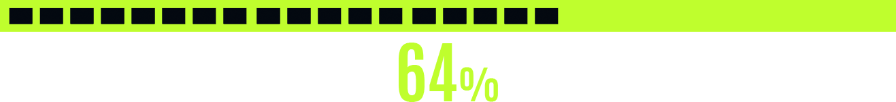

 
 

 
 

 

Rocketseat Discover is a course that guides us through development, covering back-end and front-end, and even data, for those who are stepping into technology. It explains the very basics, getting in touch with HTML, CSS, JavaScript and other technologies over time.

##### O curso Discover, da Rocketseat, é um guia introdutório ao mundo do desenvolvimento, que percorre tanto o front-end, quanto o back-end, e pincela até mesmo a área de dados, para aqueles que estão dando seus primeiros passos. O curso explica o básico, em contato com HTML, CSS, JavaScript e outras tecnologias.

 
 
 
 

 

 
 
 
 

 

|  Topic       |  Content        |  Done        |
| ------------------ | ------------------ | :--------------------------------------------: |
|  Intro      | HTTP, URLs, TCP, IP, Proxy, browsers, MAC Adress, DNS, hardware, software |  |
|  HTML      | SEO, tables, meta, social meta, favicon |  |
|  CSS  | Box model, shorthands, vendor prefixes, functions, root |  |
|  JavaScript  | DOM, callback, Promises, Async-Await |  |
|  NodeJs  | Packages, scripts, global dependency, timers, event modules |  |
|  EJS  | Reuse code, pages |  |
|  SQL  | Data, tables, SELECT, operators |  |
|  Git  | CheatSheet, git log, hash values, HEAD |  |
|  API  | Back-end, front-end |  |
|  ReactJs  | JSX, components, Key Prop, Hooks  | |
|  TypeScript  | Functions, Type Assertions  |  |

 
 
 
 
 

